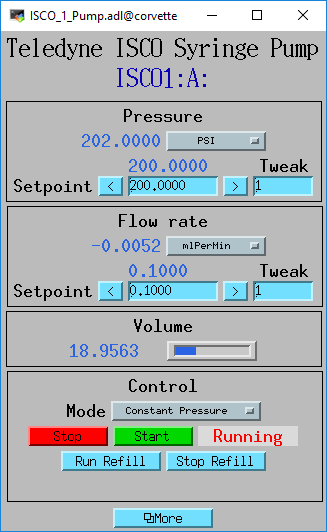
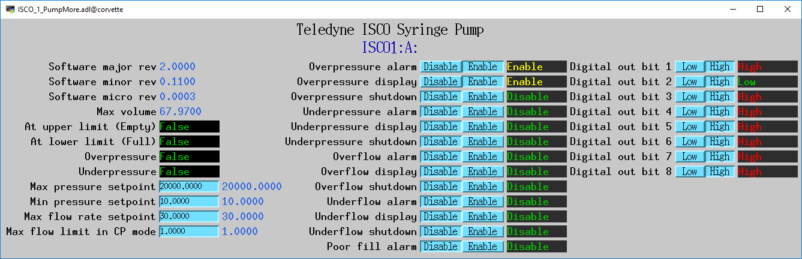

An [EPICS](http://www.aps.anl.gov/epics/) 
module that supports syringe pumps from Teledyne ISCO and Vindum Engineering
via the Modbus protocol.

This package contains:
- Database files
- OPI screens
- An example IOC application
- An example iocBoot directory with startup scripts

Currently this module only supports Teledyne ISCO pumps with Modbus communication.  
I plan to add support for Vindum Engineering pumps as well, again using Modbus.

These medm screens for an ISCO 65D syringe pump.

