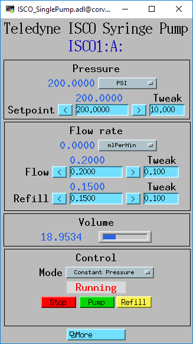
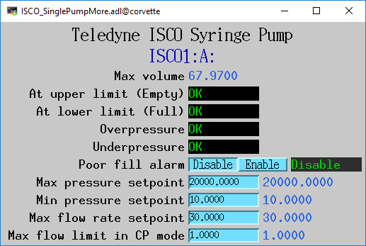
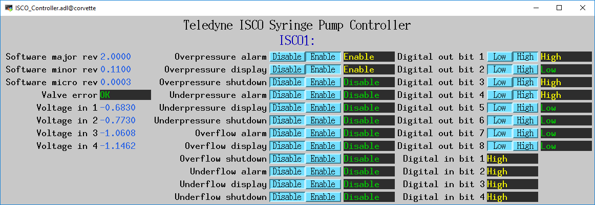
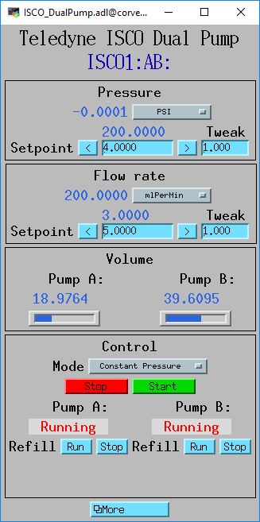
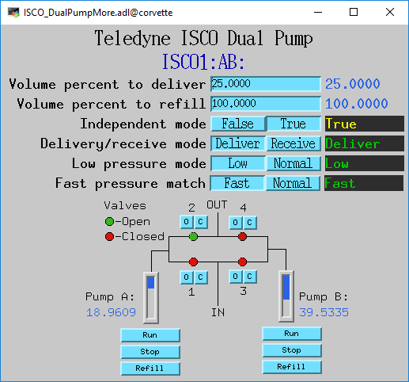
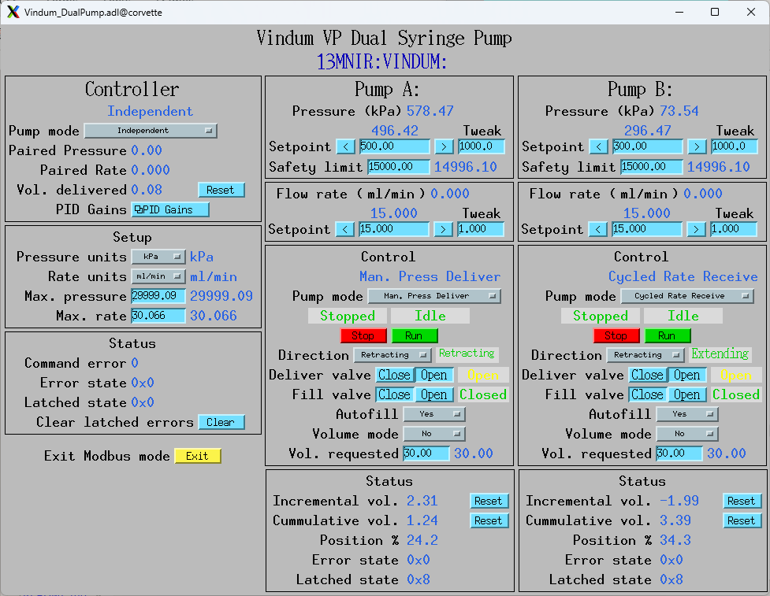
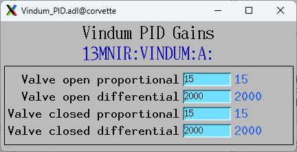
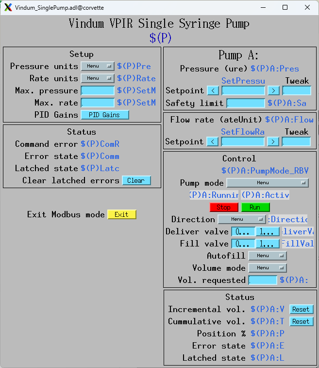

An [EPICS](http://www.aps.anl.gov/epics/) 
module that supports syringe pumps from Teledyne ISCO and Vindum Engineering
via the Modbus protocol.

This package contains:
- Database files
- OPI screens
- An example IOC application
- An example iocBoot directory with startup scripts

These are the medm screens for a single ISCO 65D syringe pump.

These are the medm screens for a dual ISCO 65D syringe pump.

This is the medm screen for a Vindum VP dual-cyclinder pump.

This is the medm screen for setting the PID gains on Vindum pumps.

This is the medm screen for a Vindum VIPR singe-cyclinder pump.
This screen is in medm "edit" mode because the pump is not currently connected.

