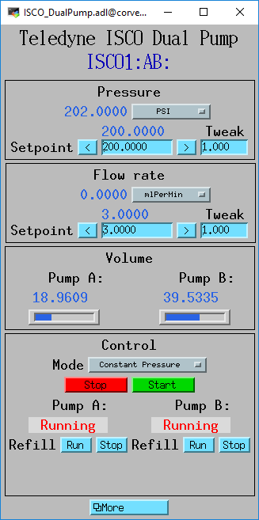

This is an [EPICS](http://www.aps.anl.gov/epics/) 
module that supports syringe pumps from Teledyne ISCO and Vindum Engineering
via the Modbus protocol.

This package contains:
- Database files
- OPI screens
- An example IOC application
- An example iocBoot directory with startup scripts

ISCO Pumps
----------

**NOTE:** ISCO pumps have a Modbus interface that can be accessed using either
Ethernet with Modbus/TCP or RS-485 with Modbus/RTU.  I have found that the
Ethernet interface is not reliable, and will frequently disconnect from
the EPICS IOC for periods from a few seconds to a few minutes.
The RS-485 interface does not have these issues, and is very reliable.

I therefore use a Moxa NP6250 terminal server to connect to the ISCO controller
over Ethernet using an RS-485 connection from the Moxa to the ISCO.

These are the medm screens for a single ISCO 65D syringe pump.

These are the medm screens for a dual ISCO 65D syringe pump.

Vindum pumps
------------

The Vindum pumps support Modbus communication over either the USB or RS-232 connection.
One needs to initially use their Windows VPWare software connection to put the pump
into Modbus mode.  

I use the the RS-232 port for the Modbus connection, using a Moxa NP6250 terminal 
server, so that the pump is accessible over Ethernet.

This is the medm screen for a Vindum VP dual-cyclinder pump.

This is the medm screen for setting the PID gains on Vindum pumps.

This is the medm screen for a Vindum VIPR singe-cyclinder pump.
This screen is in medm "edit" mode because the pump is not currently connected.

